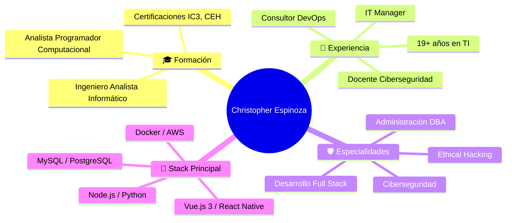
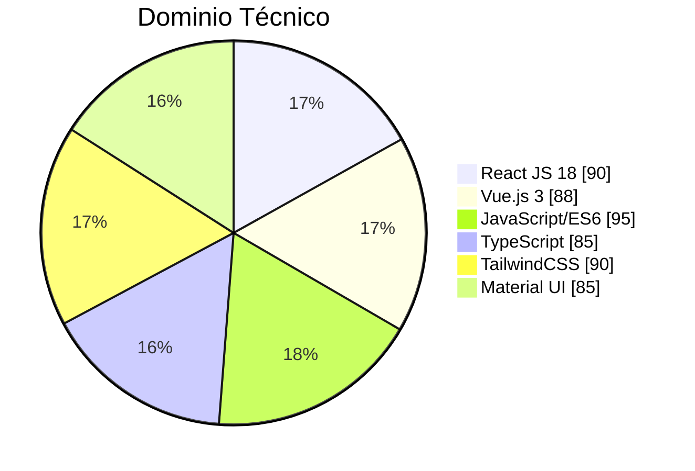

  

  
  
  
  

---

# 🚀 Portafolio Profesional 2026

  
  
  
  
  
  
  

## 📋 Tabla de Contenidos

- [📖 Sobre Mí](#-sobre-mí)
- [🛠️ Stack Tecnológico](#️-stack-tecnológico)
- [📊 Estadísticas GitHub](#-estadísticas-github)
- [🏗️ Arquitectura del Proyecto](#️-arquitectura-del-proyecto)
- [⚙️ Instalación y Configuración](#️-instalación-y-configuración)
- [📁 Estructura del Proyecto](#-estructura-del-proyecto)
- [🧪 Testing](#-testing)
- [🚀 Despliegue](#-despliegue)
- [📬 Contacto](#-contacto)
- [📄 Licencia](#-licencia)

---

## 📖 Sobre Mí

**Ingeniero Analista Informático** con más de **19 años de experiencia** en gestión de proyectos, programación y desarrollo web. Especialista en posicionamiento SEO, administración DBA y programación de bases de datos. Relator de ciberseguridad y Docente Universitario certificado en IC3.

> *"Evolucionar en el ámbito del desarrollo de software, la robótica o la domótica, mediante la adquisición continua de conocimientos y adoptar nuevos desafíos."*

---

## 🛠️ Stack Tecnológico

### Frontend

Vue 3 + Vite
This template should help get you started developing with Vue 3 in Vite. The template uses Vue 3 <script setup> SFCs, check out the script setup docs to learn more.

Learn more about IDE Support for Vue in the Vue Docs Scaling up Guide.